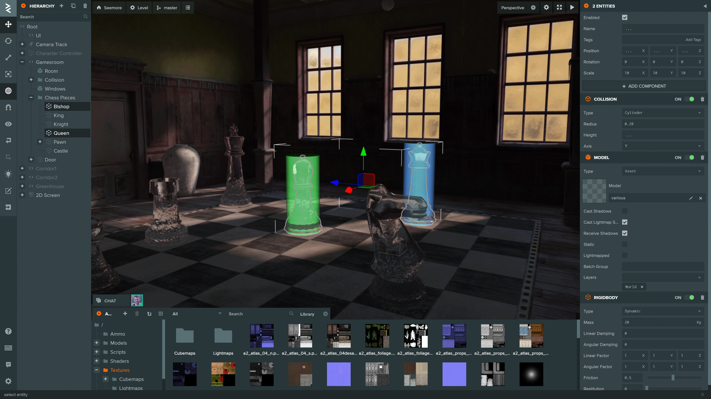

# PlayCanvas Editor

The PlayCanvas Editor is a visual editing environment for building WebGL/WebGPU/WebXR apps. It can be accessed at https://playcanvas.com.

## Open Source

The Editor is built on the following open source libraries:

| Library                                                       | Details                                     |
| ------------------------------------------------------------- | ------------------------------------------- |
| [PlayCanvas Engine](https://github.com/playcanvas/engine)     | Powers the Editor's 3D View and Launch Page |
| [Observer](https://github.com/playcanvas/playcanvas-observer) | Data binding and history                    |
| [PCUI](https://github.com/playcanvas/pcui)                    | Front-end component library                 |
| [PCUI-Graph](https://github.com/playcanvas/pcui-graph)        | PCUI plugin for rendering node-based graphs |
| [Editor API](https://github.com/playcanvas/editor-api)        | Public API for Editor automation            |

## Issues

This repo is the public issue tracker for the PlayCanvas Editor. Please submit any bugs and feature requests relating to the Editor [here](https://github.com/playcanvas/editor/issues).

## Roadmap

The PlayCanvas Roadmap can be found [here](https://github.com/orgs/playcanvas/projects/16).
